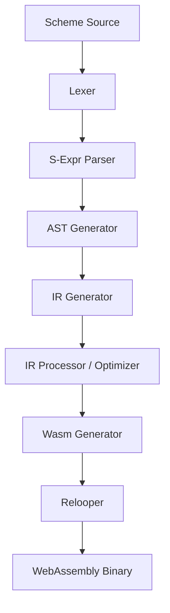

# コンパイラアーキテクチャ詳細ルール

## コンパイルパイプライン全体

Webschembly のコンパイラ (`webschembly-compiler` クレート) は、Scheme ソースコードを WebAssembly に変換するために複数の厳密なフェーズを経由する。

## 1. フロントエンド

### Lexer (字句解析)

- `nom` を使用したパーサコンビネータで実装。
- `nom_locate` を用いて、各トークンに元のソースコード上の位置情報 (`Span`) を付与する。
- S式に必要な括弧類や、ベクタ、UVector(数値配列の独自拡張)、数値(Int/Float/NaN)、文字列、真偽値等をトークン化。

### S-Expr Parser (S式構文解析)

- Lexer が出力したトークン列に対して `nom` を適用する。
- ドット対 `(a . b)` や、クォート構文糖衣 `'expr` → `(quote expr)` の展開を行う。

### AST Generator (Trees that Grow パターン)

Haskell などで知られる "Trees that Grow" パターンを採用し、コンパイルフェーズが進むごとに AST の型を安全に狭めていく。`AstPhase` トレイトの関連型を用いて拡張ポイントを制御する。

1. **Parsed**: S式からの直接の変換。拡張型は空(`()`)。
2. **Desugared**: `begin`, `cond`, `let*`, `named-let`, `do`, `quote`, `and`, `or` 等をよりプリミティブな構文(入れ子の`if`や`let`など)へ脱糖(Desugar)する。
3. **Defined**: グローバルな `define` を `set!` へ、ローカルな `define` を `letrec` へ変換し、AST から `define` ノードを完全に排除する。
4. **TailCall**: すべての関数呼び出しノード (`Call`) に対して、それが末尾呼び出しであるか (`is_tail: bool`) を注釈づける。
5. **Used (Final)**: 変数の名前解決。各変数に `VarId` (ローカルまたはグローバル) を割り振る。クロージャによってキャプチャされる変数を特定し、ヒープアロケーションが必要な変数 (`box_vars`) をマーキングする。

## 2. ミドルエンド (IR)

### IR Generator (SSA 形式の構築)

- 生成された最終 AST をもとに SSA (Static Single Assignment) 形式の中間表現を生成する。
- Scheme の値はコンパイル時・ランタイムともに全て `Obj` (Wasm GC の `anyref` 相当) としてボックス化して扱われる。プリミティブ操作の前後で `ToObj`/`FromObj` 命令が挿入される。
- クロージャは第一級オブジェクトであり、環境(キャプチャした変数)とエントリポイントテーブルを持つ。
- Variadic args (可変長引数) のサポートが含まれる。

### IR Processor & Optimizer (最適化と解析)

IR に対する解析・最適化は多岐にわたる。

1. **CFG (制御フローグラフ) 解析**: 逆ポストオーダー (`calculate_rpo`) やドミネータツリー (`build_dom_tree`) の構築。
2. **データフロー解析**: ライブネス解析 (`analyze_liveness`) と def-use 連鎖の構築。
3. **SSA 最適化**:
   - `copy_propagation`: Move命令や単一入力のPhiの伝播。
   - `constant_folding`: 定数畳み込み(四則演算、比較等)、不要な `ToObj(FromObj(x))` の除去。
   - `dead_code_elimination` (DCE): 副作用のない (`Purelity` トレイト実装) 未使用命令の削除。
   - `common_subexpression_elimination` (CSE): ドミネータツリーに基づく共通部分式の削除。
   - `inlining`: モジュールレベルの関数インライン展開 (AOTコンパイル時)。
4. **SSA の脱構築**: レジスタ割り当ての準備として SSA を破壊する。
   - `split_critical_edges`: クリティカルエッジの分割。
   - `remove_phi`: Phi ノードを逐次的な Copy (Move) 命令群に変換。サイクル(値の入れ替え)の解決アルゴリズムを含む。
5. **Register Allocation (レジスタ割り当て)**: リニアスキャンレジスタ割り当てを用いて、Wasm のローカル変数へのマッピングを決定。

## 3. バックエンド

### Relooper

- Wasm は `goto` ではなく構造化制御フロー (ブロック、ループ) を要求するため、CFG から構造化制御フローを復元する必要がある。
- 論文 _"Simple and Efficient Construction of WebAssembly Control Flow"_ (Stackifier/Relooper) のアルゴリズムを実装。
- ドミネータツリーとループヘッダを利用して `Simple`, `If`, `Block`, `Loop`, `Break`, `Exit` の構造を再構築する。

### Wasm Generator

- `wasm-encoder` を使用してバイナリを出力。
- Wasm GC 命令を全面的に活用し、Scheme の型を Wasm struct/array にマッピングして出力する。
